<!--
  ████████████████████████████████████████████████████████████
  █  TEJ GOKANI · PROFILE.SYS v5.0                           █
  █  every pixel below is a hand-written animated SVG.       █
  █  no stat cards. no generators. no templates.             █
  ████████████████████████████████████████████████████████████
-->

  
  
  
  
  

   

  <a href="mailto:tejmgokani@gmail.com"><code>▸ tejmgokani@gmail.com</code></a>
  &nbsp;·&nbsp;
  <code>▸ you are already at the right repo</code>

